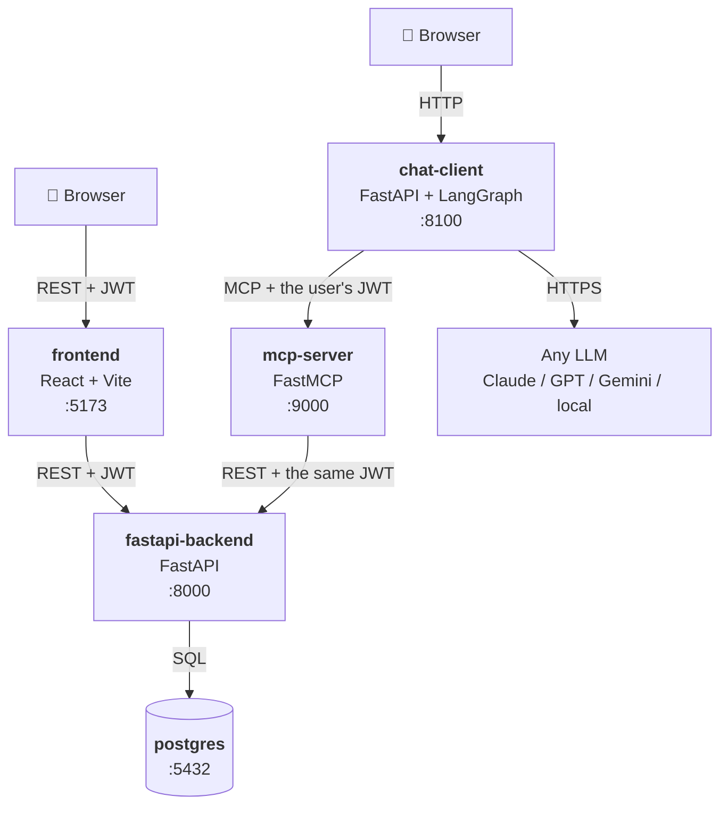

# TaskFlow — learn MCP properly

A small task tracker, given an AI interface. Four independent services, one
database, one `docker compose up`.

This repo is the companion to blog series **"MCP, from scratch"**. Every file in
it exists to teach one thing, and every line is explained in the series. If you
have never written an MCP server before, you are the target reader.

> **New to MCP itself?** Start with the previous series,
> [Building a Moodle MCP Server](https://github.com/Jayantkhandebharad/MCP-LMS-OSS),
> which covers what MCP *is*. This series assumes you know the vocabulary and
> nothing else.

---

## What it does

TaskFlow is deliberately boring: users, projects, tasks, comments.

- You sign up and create a **project**. You become its **admin**.
- Admins add other users as **admin** or **member**.
- Members create tasks, assign them, move them through statuses, comment on them.
- Only admins delete tasks or manage members.

That's the whole product. The interesting part is what sits next to it.

---

## Architecture



**The decision that shapes everything:** the MCP server never touches the
database. It calls the backend's REST API, carrying the logged-in human's own
token — exactly like the frontend does.

That means the rules ("only admins delete tasks") are written **once**, in the
backend. It also means the AI is not a superuser: the MCP server holds no
credentials of its own, so it can only ever do what the person talking to it is
already allowed to do.

Notice that the backend and the frontend don't know MCP exists. That's the point
— **MCP is a layer you add to a working app, not an architecture you build
around.**

---

## The four services

| Service | Port | Its one job |
|---|---|---|
| `fastapi-backend` | 8000 | Own the data and enforce the rules. Knows nothing about MCP or AI. |
| `frontend` | 5173 | Let a human use the app with a mouse. Knows nothing about MCP or AI. |
| `mcp-server` | 9000 | Translate the backend's REST API into MCP tools an AI can call. Stores nothing. |
| `chat-client` | 8100 | Let a human use the app by typing English. Runs the agent loop. |

---

## Quick start

```bash
git clone https://github.com/Jayantkhandebharad/mcp-taskflow.git
cd mcp-taskflow
cp .env.example .env
docker compose up
```

Right now that starts PostgreSQL and nothing else — the services are being built
one phase at a time (see [Status](#status)). Check the database is up:

```bash
docker compose ps
docker compose exec db psql -U taskflow -d taskflow -c '\dt'
```

The backend runs on your machine for now (it moves into Compose in phase 12).
Build the schema, load the demo data, and start the API:

```bash
cd fastapi-backend
uv sync                          # one-time: creates .venv/ from uv.lock
uv run alembic upgrade head      # create the tables
uv run python -m scripts.seed    # 3 users / 2 projects / 15 tasks, rerunnable
uv run uvicorn app.main:app --reload --port 8000
```

Then log in as a demo user and ask the API who you are:

```bash
TOKEN=$(curl -s -X POST localhost:8000/auth/login \
  -H 'Content-Type: application/json' \
  -d '{"email":"alice@example.com","password":"password"}' | jq -r .access_token)

curl -s localhost:8000/auth/me -H "Authorization: Bearer $TOKEN"
```

Every demo account's password is `password`. The interactive API page is at
http://localhost:8000/docs, and `uv run pytest` runs the tests against the same
Postgres.

The web app also runs on your machine for now. In a second terminal:

```bash
cd frontend
npm install                      # one-time, from package-lock.json
npm run dev                      # http://localhost:5173
```

Log in as `alice@example.com` / `password` and you can do everything the API
can: projects, a board, tasks, comments, members. `npm run walkthrough` drives
all of it in a headless Chrome and checks what a person would check.

The MCP server runs on your machine as well, over two transports: Streamable
HTTP on `:9000/mcp` (the default — what a curl or the future chat client
uses) and stdio, the transport desktop AI clients use to launch a local
server. Register the stdio form with Claude Desktop, restart the app, and ask
"who am I logged in as?":

```bash
cd mcp-server
uv sync
uv run python -m scripts.claude_desktop alice@example.com password
uv run python -m app.server          # HTTP on :9000/mcp — bearer token per request
uv run pytest                        # drives the server over stdio and HTTP, against a real backend
```

The server has no credentials of its own. Over stdio it logs in as the person
you named at startup; over HTTP it logs nobody in and instead verifies the
`Authorization: Bearer <jwt>` each request already carries. Either way, every
tool call rides that person's token to the same API the web app uses. Log in
as Bob instead and the assistant sees one project, not two.

---

## Bring your own model

The chat client is **not** tied to any LLM vendor. Exactly one file in this repo
(`chat-client/app/llm.py`) knows which provider is in use. Switching is one line
in `.env`:

```bash
LLM_MODEL=anthropic:claude-opus-4-8
# LLM_MODEL=openai:gpt-4.1
# LLM_MODEL=google_genai:gemini-2.0-flash
# LLM_MODEL=ollama:qwen2.5:14b        # fully local, no API key, no internet
```

Any OpenAI-compatible gateway works too (LiteLLM, vLLM, OpenRouter, Groq,
LM Studio) — point `OPENAI_API_BASE` at it.

⚠️ **Model independence is not model equivalence.** MCP is tool calling, and the
agent loop asks the model to pick the right tool from a dozen, fill its arguments
correctly, read the result, and decide what to do next. Frontier models handle
that reliably; small local models often do not. Once the chat client exists, this
README will carry honest field notes on what we tested and how each model actually
behaved — failures included.

---

## Repository layout

```
fastapi-backend/   the system of record. owns the database.
mcp-server/        the MCP layer. owns no data.
chat-client/       the MCP client. talks to the LLM.
frontend/          the normal web app. no MCP anywhere.
docs/
  architecture.md  the long-form version of the diagram above
  decisions/       ADRs — why we chose what we chose
  briefs/          raw notes per phase; the blog posts are written from these
docker-compose.yml one command boots everything
.env.example       every variable, documented
PLAN.md            the full plan: data model, auth, tool design, build order
```

Each top-level folder is one container, one dependency file, one job. If a
folder's job can't be said in one sentence, it's doing too much.

---

## Status

Built in phases. Each one ends with something that runs.

- [x] **0** — Skeleton: repo, layout, `.env.example`, Postgres in Compose
- [x] **1** — Schema, migrations, seed data
- [x] **2** — Auth: register, login, JWT
- [x] **3** — Backend API: projects, members, tasks, comments
- [x] **4** — Frontend
- [x] **5** — First MCP server (stdio) 🚩
- [x] **6** — MCP over HTTP, with auth passthrough
- [ ] **7** — The full toolset
- [ ] **8** — RBAC gating, resources, prompts 🚩
- [ ] **9** — Chat client: the LangGraph agent 🚩
- [ ] **10** — Per-user auth in the client
- [ ] **11** — Model independence: same agent, different brains 🚩
- [ ] **12** — Containerise everything
- [ ] **13** — Polish

🚩 = the posts this whole series exists for.

---

## License

MIT — see [LICENSE](LICENSE).
